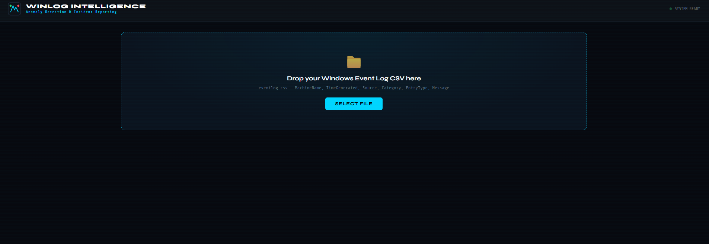
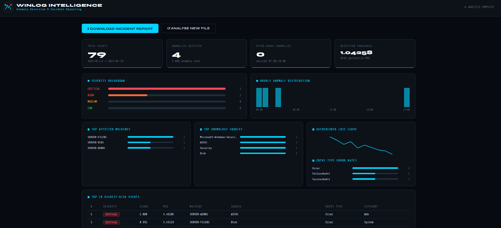

# WinLog Intelligence

**Anomaly Detection & Incident Reporting for Windows Event Logs**

An end-to-end DL pipeline that ingests Windows Event Log CSV exports, trains an unsupervised PyTorch Autoencoder to learn normal behaviour, flags anomalies by reconstruction error, and generates a structured incident report with AI-written narrative sections (Flan-T5).

---

## Project Structure

```
windows-log-app/
├── main.py                      ← FastAPI server (routes only)
├── requirements.txt
├── static/
│   └── index.html               ← Dark SOC dashboard frontend
├── reports/                     ← Generated incident reports (.txt)
├── uploads/                     ← Temporary upload storage
└── pipeline/                    ← ML package
    ├── __init__.py
    ├── model.py                 ← Autoencoder architecture
    ├── features.py              ← Feature engineering
    ├── detector.py              ← Training + anomaly detection
    └── report.py                ← LLM report generation
```

---

## How It Works

```
Upload CSV
    │
    ▼
features.py        Temporal encoding, Label Encoding,
build_features()   TF-IDF on Message, message statistics
                   → feature matrix  (n_samples × ~79 features)
    │
    ▼
detector.py        Symmetric Autoencoder trained for 30 epochs
run_pipeline()     Reconstruction MSE > 95th percentile = anomaly
                   Normalised score → CRITICAL / HIGH / MEDIUM / LOW
    │
    ▼
report.py          build_summary() assembles stats dict
write_report()     Flan-T5 generates 4 narrative sections
                   → incident_YYYYMMDD_HHMMSS.txt
```

---

## API Endpoints

| Method | Endpoint | Description |
|--------|----------|-------------|
| `POST` | `/upload` | Upload CSV → starts background pipeline job |
| `GET` | `/job/{job_id}` | Poll job status and results |
| `GET` | `/report/{job_id}` | Download the incident report (.txt) |
| `GET` | `/health` | Health check + device info |
| `GET` | `/` | Serve the frontend dashboard |

### Job Status Flow

```
queued → feature_engineering → training_autoencoder → detecting_anomalies → generating_report → done
```

---

## Pipeline Details

### Feature Engineering (`features.py`)

| Group | Features | Count |
|---|---|---|
| Temporal | hour, dayofweek, day, month, quarter, after_hours, is_weekend + sin/cos cyclical | 11 |
| Categorical | LabelEncoder on MachineName, Category, EntryType, Source | 4 |
| TF-IDF | Top 50 bi-gram tokens from Message field | 50 |
| Message Stats | length, word count, upper/digit ratios, IP flag, error/login keywords | 7 |

### Autoencoder (`model.py`)

```
Architecture : Input → 128 → 64 → 32 → 16 → 32 → 64 → 128 → Input
Layers       : Linear + BatchNorm1d + ReLU + Dropout(0.1) per block
Optimizer    : Adam  (lr=1e-3, weight_decay=1e-5)
Loss         : MSELoss
Epochs       : 30
Batch size   : 256
Device       : CUDA if available, else CPU
```

### Anomaly Detection (`detector.py`)

- **Threshold**: 95th percentile of per-sample reconstruction MSE
- **Anomaly score**: min-max normalised error → [0, 1]
- **Severity mapping**:

| Score | Severity |
|---|---|
| ≥ 0.9 | CRITICAL |
| ≥ 0.7 | HIGH |
| ≥ 0.5 | MEDIUM |
| < 0.5 | LOW |

### Incident Report (`report.py`)

LLM model: `google/flan-t5-base` (loaded once, cached in memory).

Four AI-generated sections:
1. **Executive Summary** — 2-sentence CISO briefing
2. **Impact Assessment** — operational, data, and reputational risk
3. **Root Cause Analysis** — top 3 likely causes from sources and message samples
4. **Remediation Recommendations** — 4 numbered steps with P1/P2/P3 priorities

> **Note**: Flan-T5-base has a 512-token input limit. Prompts are kept under ~200 tokens each to ensure the model generates text rather than echoing its input.

---

## Installation

### 1. Clone / copy the project

```
windows-log-app/
├── main.py
├── requirements.txt
├── pipeline/
└── static/
```

### 2. Install dependencies

```bash
pip install -r requirements.txt
```

For CPU-only PyTorch (faster download):
```bash
pip install -r requirements.txt --index-url https://download.pytorch.org/whl/cpu
```

### 3. Run the server

```bash
python main.py
```

Or with uvicorn directly:
```bash
uvicorn main:app --reload --host 0.0.0.0 --port 8000
```

Open **http://localhost:8000** in your browser.

---

## Usage

1. Open the dashboard at `http://localhost:8000`
2. Drag and drop (or click to browse) a Windows Event Log CSV file
3. Watch the 4-stage pipeline progress in real time:
   - Feature Engineering
   - Autoencoder Training
   - Anomaly Detection
   - Generating Report
4. View the results dashboard — KPIs, severity breakdown, hourly chart, top anomaly table
5. Click **Download Report** to save the full incident report as a `.txt` file

---

## Input CSV Format

The pipeline expects a CSV with at least these columns:

| Column | Type | Notes |
|---|---|---|
| `TimeGenerated` | datetime | Parsed automatically |
| `MachineName` | string | Hostname |
| `Source` | string | Event provider |
| `EntryType` | string | Error / Warning / Information |
| `Category` | string | Event category |
| `Message` | string | Full event message text |

Optional geo-enrichment columns (if present):
`country`, `regionName`, `city`, `timezone`, `isp`

A sample file `eventlog_sample.csv` with 80 realistic events is included for testing.

---

## Requirements

```
Python        >= 3.10
fastapi       >= 0.110.0
uvicorn       >= 0.29.0
pandas        >= 2.0.0
numpy         >= 1.24.0
scikit-learn  >= 1.3.0
torch         >= 2.0.0
transformers  >= 4.40.0
sentencepiece >= 0.1.99
```

---

## Notebooks

The pipeline was developed in four Jupyter notebooks:

| Notebook | Purpose |
|---|---|
| `01_eda.ipynb` | Exploratory data analysis |
| `02_feature_engineering.ipynb` | Feature construction and scaling |
| `03_autoencoder_training.ipynb` | Model training and threshold selection |
| `04_incident_generation.ipynb` | LLM report generation (source of truth for prompts and field names) |

The `pipeline/` package is a direct translation of these notebooks into production code, using the same logic, field names, and prompt templates.

---

## Troubleshooting

**Frontend freezes on "Done ✓"**
The results dashboard supports both old and new backend field names via `??` fallbacks (e.g. `total_events ?? total_records`). If you see a freeze, open the browser console — a descriptive error will be printed.

**`ModuleNotFoundError: flask_cors`**
Run `pip install flask-cors` or install the full requirements file.

**LLM echoes raw input instead of generating text**
Prompts exceeded Flan-T5-base's 512-token input limit. This is handled automatically — prompts are capped at ~200 tokens each.

**UnicodeEncodeError on Windows**
All file writes use `encoding="utf-8"` explicitly. If you still see this, set your terminal to UTF-8: `chcp 65001`.

**CUDA out of memory**
The model falls back to CPU automatically. To force CPU, set `DEVICE = "cpu"` in `pipeline/detector.py`.


## Screenshot




